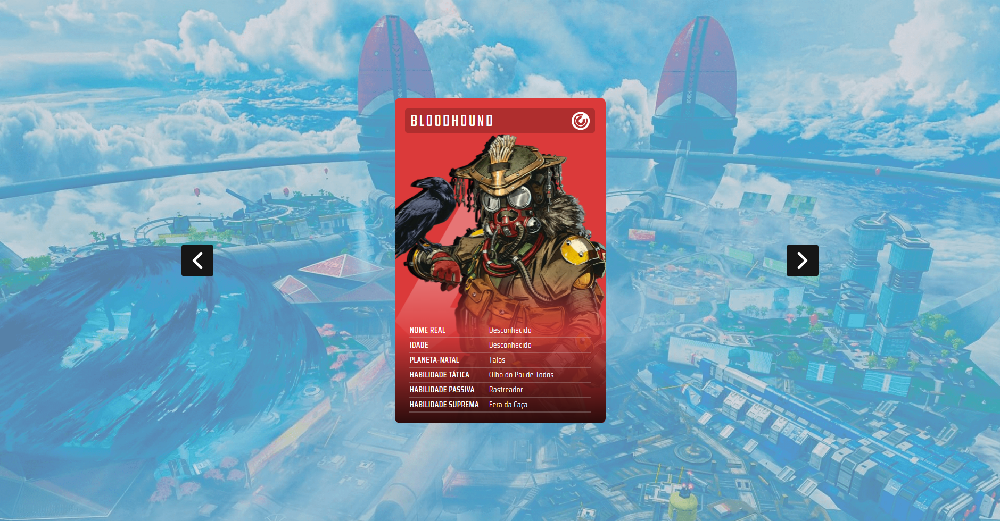
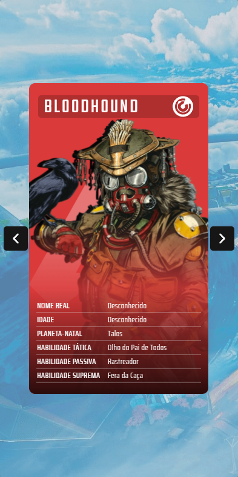

# Projeto Apex Slider

Este projeto foi baseado no [Pokemon Slider](https://github.com/cristianescs/projeto-pokemon-slider-mapadev-week).
No projeto é possível ver cartas que são baseadas no jogo Apex Legends, um jogo de FPS e Battle Royale. Neste jogo há vários personagens e cada um tem suas próprias habilidades e histórias, nas cartas é possível ver informações sobre cada personagem que tem no jogo como suas respectivas classes.

Para o desenvolvimento do site foi utilizado:
- HTML5
- CSS3
- JavaScript (JQuery)
- Tilt.js (Biblioteca JavaScript)

### Objetivo

O propósito deste projeto foi colocar em prática o que foi aprendido durante o evento do MapaDev Week que foi realizado pelo canal Dev em Dobro no Youtube. O Objetivo principal era um criar um slider utilizando javascript.

### Design

O design do projeto foi todo feito pelo Figma, a fonte foi pensada baseada na fonte original que é utilizada no site oficial do Apex Legends, as informações contidas nas cartas também foram retiradas do site oficial.

---> [Design no Behance](https://www.behance.net/gallery/149967031/Apex-Legends-Card-Design)

### Resultado

